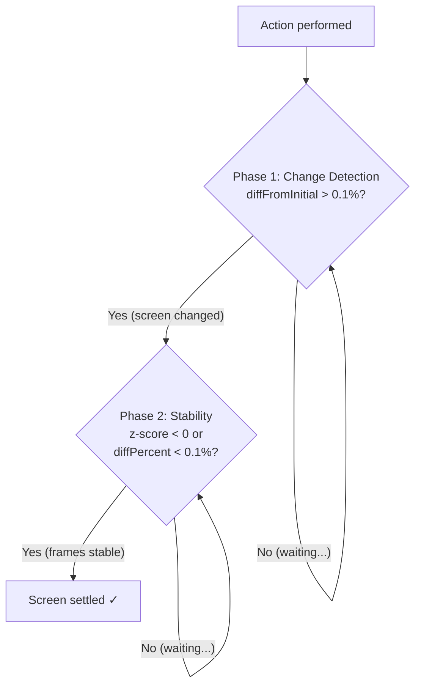

<!-- Generated from redraw.mdx. DO NOT EDIT. -->

## Overview

The redraw system waits for the screen to stabilize after an interaction before continuing. It detects when animations, page loads, and network requests have settled, preventing actions from being performed on a changing screen.

<Note>
  **Redraw is disabled by default since v7.3.** Enable it explicitly if your tests interact with applications that have significant animations or loading states.
</Note>

## How It Works

Redraw uses a **two-phase detection** approach:

1. **Change Detection** — Compare the current frame to the initial screenshot taken right after the action. If the pixel diff exceeds 0.1%, the screen has changed.
2. **Stability Detection** — Compare consecutive frames using z-score analysis. When the diff between frames drops below 0.1% or the z-score is negative (current diff is below average), the screen has settled.

The screen is considered **settled** when both phases complete: the screen changed from the initial state AND consecutive frames are now stable.



### Polling

The system polls at **500ms intervals**, comparing screenshot frames. This reduces WebSocket traffic while still providing responsive detection.

### Pixel Comparison

Uses [pixelmatch](https://github.com/mapbox/pixelmatch) for per-pixel comparison with a threshold of `0.1` for pixel sensitivity. A frame diff above **0.1% of total pixels** indicates the screen has changed.

### Z-Score Analysis

Screen stability uses statistical analysis of the last **10 measurements**:

1. Calculate the mean and standard deviation of consecutive frame diffs
2. Compute the z-score: `(currentDiff - mean) / stddev`
3. Screen is stable when `diffPercent < 0.1%` or `z-score < 0` (current diff is below the average)

This approach adapts to the specific animation patterns of your application rather than using a fixed threshold.

## Per-Command Timeouts

Each command type has a specific redraw timeout:

| Command | Timeout | Reason |
|---------|---------|--------|
| `click` | 5000ms | Page navigations, modal openings |
| `hover` (within click) | 5000ms | Same as click |
| `hover` (standalone) | 2500ms | Tooltip animations |
| `scroll` | 5000ms | Lazy-loaded content |
| `type` | 5000ms | Autocomplete, validation |
| `pressKeys` | 5000ms | Keyboard shortcuts may trigger changes |
| `focusApplication` | 1000ms | Window focus animations |

If the timeout is reached before the screen settles, the command continues anyway. The timeout event is available via the `redraw:complete` event.

## Configuration

### Constructor Options

```javascript
const testdriver = new TestDriver({
  // Shorthand: enable/disable
  redraw: true,    // enable with defaults
  redraw: false,   // disable (default since v7.3)

  // Full configuration
  redraw: {
    enabled: true,
    screenRedraw: true,       // enable screen pixel diff detection
    networkMonitor: false,    // enable network settling detection
  },
});
```

<ParamField path="redraw" type="RedrawConfig | boolean" default={false}>
  Redraw configuration. Pass `true`/`false` for shorthand, or an object for fine-grained control.

  <Expandable title="properties">
    <ParamField path="enabled" type="boolean" default={false}>
      Enable or disable the redraw system. Default changed to `false` in v7.3.
    </ParamField>
    
    <ParamField path="screenRedraw" type="boolean" default={true}>
      Enable pixel-diff-based screen change detection. If both `screenRedraw` and `networkMonitor` are `false`, redraw auto-disables.
    </ParamField>
    
    <ParamField path="networkMonitor" type="boolean" default={false}>
      Enable network traffic monitoring for settling detection. Monitors WebSocket traffic on the sandbox to detect when network activity subsides.
    </ParamField>
  </Expandable>
</ParamField>

### Per-Command Override

Override redraw settings for individual commands:

```javascript
// Enable redraw for a specific click
await testdriver.find('load more').click({
  redraw: { enabled: true },
});

// Disable redraw for a fast interaction
await testdriver.find('checkbox').click({
  redraw: false,
});
```

## Network Settling

When `networkMonitor` is enabled, the system also monitors sandbox network traffic:

- Polls for `totalBytesReceived` and `totalBytesSent` from the sandbox
- Keeps the last **60 measurements**
- Calculates z-scores for both RX and TX byte rates
- Network is **settled** when both RX and TX z-scores are negative (traffic is below average)
- Has a **10-second timeout** for network polling
- Non-critical: network errors are logged but never throw

The final settling condition requires **both** screen AND network to be settled (when both are enabled).

## Events

The redraw system emits events through the SDK emitter. See [Events](/v7/events) for the full event reference.

| Event | Description |
|---|---|
| `redraw:status` | Emitted on each poll with current screen diff, network stats, and timeout info |
| `redraw:complete` | Emitted when redraw resolves (settled or timed out) |

```javascript
testdriver.emitter.on('redraw:status', (status) => {
  console.log(`Screen: ${status.redraw.text}`);
  console.log(`Network: ${status.network.text}`);
  console.log(`Timeout: ${status.timeout.text}`);
});

testdriver.emitter.on('redraw:complete', (result) => {
  if (result.isTimeout) {
    console.warn(`Redraw timed out after ${result.timeElapsed}ms`);
  } else {
    console.log(`Screen settled in ${result.timeElapsed}ms`);
  }
});
```

## When to Use Redraw

**Enable redraw when:**
- Testing single-page applications (SPAs) with route transitions
- Interacting with pages that lazy-load content on scroll
- Clicking buttons that trigger animations or modals
- Testing apps with significant network-driven UI updates

**Keep redraw disabled when:**
- Tests are already stable without it
- You want faster test execution
- Your application has minimal animations
- You're using explicit waits or assertions instead

## Types

```typescript
interface RedrawConfig {
  enabled?: boolean;              // Default: false (since v7.3)
  screenRedraw?: boolean;         // Default: true
  networkMonitor?: boolean;       // Default: false
}

interface RedrawStatusEvent {
  redraw: {
    enabled: boolean;
    settled: boolean;
    hasChangedFromInitial: boolean;
    consecutiveFramesStable: number;
    diffFromInitial: number;
    diffFromLast: number;
    text: string;
  };
  network: {
    enabled: boolean;
    settled: boolean;
    rxBytes: number;
    txBytes: number;
    text: string;
  };
  timeout: {
    isTimeout: boolean;
    elapsed: number;
    max: number;
    text: string;
  };
}

interface RedrawCompleteEvent {
  screenSettled: boolean;
  hasChangedFromInitial: boolean;
  consecutiveFramesStable: number;
  networkSettled: boolean;
  isTimeout: boolean;
  timeElapsed: number;
}
```
