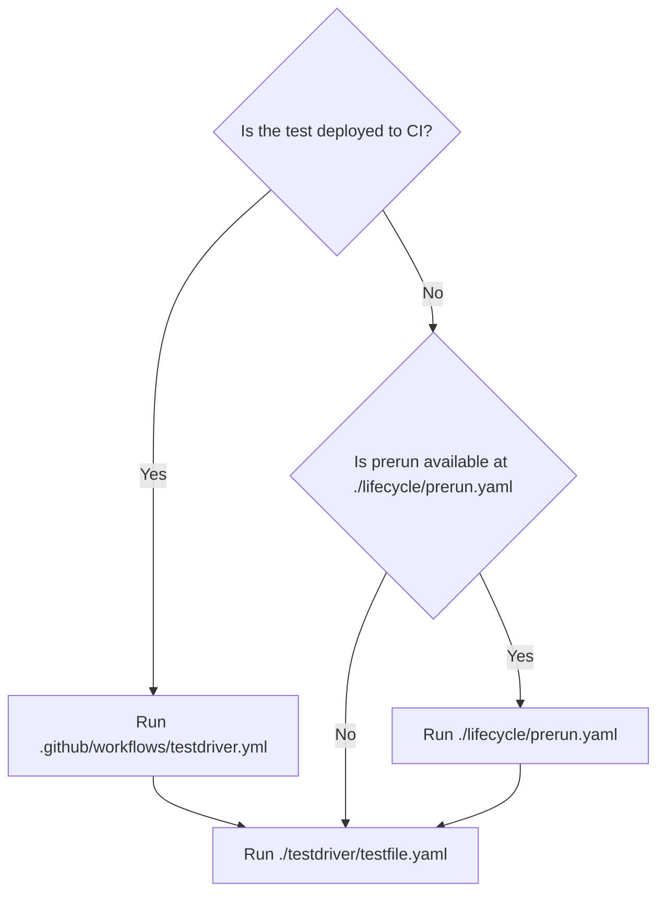

import LifecycleWarning from '/snippets/lifecycle-warning.mdx'

## Prerun configuration

<LifecycleWarning/>

## The default `prerun` script
When setting up your TestDriver environment, a default prerun script is automatically generated when you run:
```bash
 testdriverai init
``` 

The directory structure is created like this:
```bash
testdriver
├── lifecycle
│   └── prerun.yaml
```

This script includes essential commands to ensure your **local agent or sandbox** VM is ready for testing. You can customize this script to suit your specific needs, but it's important to understand that it serves as a baseline for your test environment. It looks like this:
 

```yaml ./lifecycle/prerun.yaml
version: 5.1.1
steps:
  - prompt: launch chrome
    commands:
      - command: exec
        lang: shell
        linux: |
          jumpapp google-chrome --disable-fre --no-default-browser-check --no-first-run "${TD_WEBSITE}" &
          exit
        mac: |
          open -na "Google Chrome" --args --disable-fre --no-default-browser-check --no-first-run --disable-features=PasswordManagerEnabled "${TD_WEBSITE}" &
          exit
        windows:
          Start-Process "C:/Program Files/Google/Chrome/Application/chrome.exe" -ArgumentList "--start-maximized", "${TD_WEBSITE}"
          exit
      - command: wait-for-text
        text: "Google Chrome"
        timeout: 30000
```
Take note that it defaults to launching the Chrome browser. If you want to use a different browser, you can modify the `prompt` and `commands` sections accordingly. 

<Warning>
The `wait-For-text` command is crucial for ensuring that the browser is fully loaded before proceeding with the test steps. If you are testing a web application, you may want to adjust the `text` parameter to match the expected app name, title or content of the page.
</Warning>

If a file is found at `./lifecycle/prerun.yaml`, it's executed _before_ the test begins. _This will happen even if you have a pre or post test script defined in your GitHub Actions workflow._ This file works like any other TestDriver file and is commonly used to perform tasks such as opening a browser, navigating to a specific page, or resetting the application state.

Note that the `prerun` script is found in the GitHub Actions workflow file for deployed tests.

### Prerun flow

---

## Examples
For example, the `prerun.yaml` file can be combined with the [`exec`](/commands/exec) command to open the Chrome browser and navigate to a page, similar to the example provided above. This ensures that the test environment is properly set up before the test starts. _Note that the prerun is a TestDriver test file like any other, combining commands to complete a task_.

---

### Opening a different browser
Here is an example of a `prerun.yaml` file that opens Firefox instead of Chrome (note the `wait-for-text` command at the end):

```yaml {5, 16} ./lifecycle/prerun.yaml
version: 5.1.1
steps:
  - prompt: launch firefox
    commands:
      - command: exec
        lang: shell
        linux: |
            jumpapp firefox --no-default-browser-check --no-first-run "${TD_WEBSITE}" &
            exit

        mac: |
            open -na "Firefox" --args --no-default-browser-check --no-first-run "${TD_WEBSITE}" &
            exit

        windows: |
            Start-Process "C:/Program Files/Mozilla Firefox/firefox.exe" -ArgumentList "--no-default-browser-check", "--no-first-run", "${TD_WEBSITE}"
            exit
      - command: wait-for-text
        text: "Firefox"
        timeout: 30000
```

---
### Loading a calculator app on Linux, MacOS or Windows
```yaml ./lifecycle/prerun.yaml
version: 5.5.5
steps:
  - prompt: launch a calculator
    commands:
      - command: exec
        lang: shell
        linux: |
          linux: |
            jumpapp /usr/bin/galculator > /dev/null 2>&1 &
            exit
        mac: |
          open "/Applications/Calculator.app"
          wait
        windows:
          start /B calc.exe
          timeout /t 5
      - command: wait-for-text
        text: "galculator"
        timeout: 30000
```

## Key points
- **Provisioning**: Prerun scripts allow you to provision the VM with the necessary tools and configurations before running tests.
- **Reproducibility**: By ensuring a consistent environment, prerun scripts help prevent flaky tests caused by environmental differences.
- **Flexibility**: You can use prerun scripts to customize the VM for specific test scenarios, such as installing alternative browsers or setting up staging environments.

---

## Best practices
- **Keep It Simple**: Write clear and concise prerun scripts to minimize setup time and reduce complexity.
- **Error Handling**: Include checks to verify that dependencies are installed successfully. Log errors to help debug issues.
- **Optimize Performance**: Cache dependencies or use lightweight tools to speed up the setup process.
- **Security**: Avoid hardcoding sensitive information in prerun scripts. Use GitHub secrets to securely pass credentials or tokens.


---
## Example

### Using `exec` shell commands in prerun to set up a test file
Here we're doing the exact same thing as the previous example, except the `shell` context is setting up the calculator app to be used by the test file. This method is useful if you are going to use the same application over again in many tests.

```yaml ./lifecycle/prerun.yaml
version: 5.5.5
steps:
  - prompt: launch a calculator
    commands:
      - command: exec
        lang: shell
        linux: |
          linux: |
            jumpapp /usr/bin/galculator > /dev/null 2>&1 &
            exit
        mac: |
          open "/Applications/Calculator.app"
          wait
        windows: start /B calc.exe
          timeout /t 5
      - command: wait-for-text
        text: "calculator"
        timeout: 30000
```

Then in the test file, the runner will already have the calculator loaded before it runs this test:
```yaml testfile.yaml
version: 5.5.5
steps:
    - prompt: /try performing the operation 2 + 2 = on the calculator that is opened
        commands:
        - command: focus-application
            name: galculator
        - command: hover-image
            description: button with number 2 on the calculator
            action: click
        - command: hover-image
            description: plus button on the calculator
            action: click
        - command: hover-image
            description: button with number 2 on the calculator
            action: click
        - command: hover-image
            description: equals button on the calculator
            action: click
```

<Tip>See [`exec`](/commands/exec) for more examples and use cases of including `shell` or `js` context and proper usage within your prerun!</Tip>

---

## Notes
- Prerun scripts are executed on the VM before the test suite begins.
- They're essential for ensuring a consistent and reliable test environment.
- For advanced workflows, combine prerun scripts with TestDriver prompts to create dynamic and flexible test setups.
- Currently, there is no teardown task implemented within TestDriver itself. This is due to the nature of deployed tests: when running on GitHub Actions, the virtual machine (VM) is _ephemeral_, meaning everything is destroyed after the test run.
