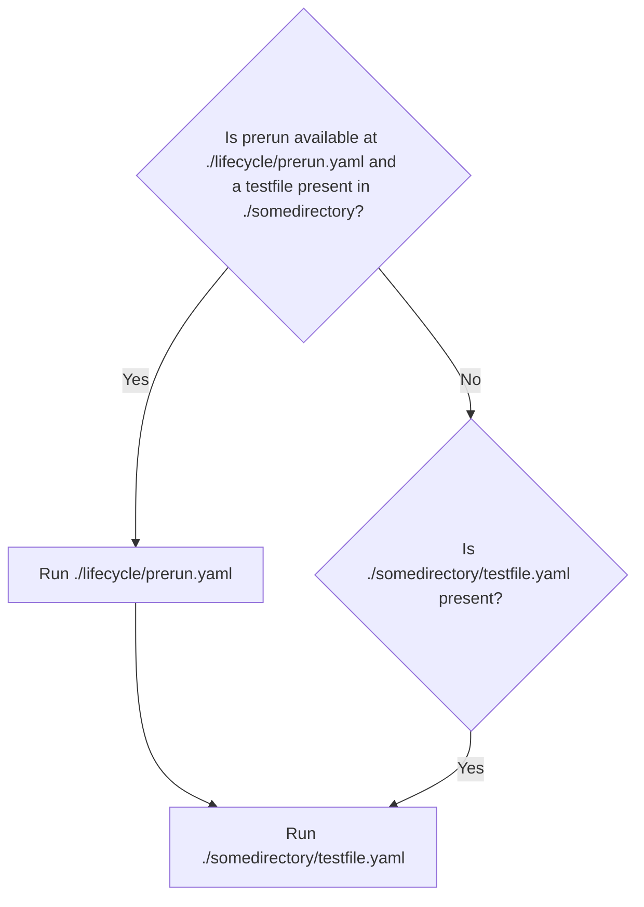

## Prerun configuration

If a file is found at `testdriver/lifecycle/prerun.yaml`, it's executed _before_ the test begins. This file works like any other TestDriver file and is commonly used to perform tasks such as opening a browser, navigating to a specific page, or resetting the application state.

### Prerun diagram

---

### Example
For example, the `prerun.yaml` file can be combined with the [`exec`](/commands/exec) command to open the Chrome browser and navigate to a page, similar to the example provided above. This ensures that the test environment is properly set up before the test starts. _Note that the prerun is a TestDriver test file like any other, combining commands to complete a task_.


Here is an example of a `prerun.yaml` file that opens Chrome:

```yaml {5, 16}
version: 5.1.1
steps:
  - prompt: launch chrome
    commands:
      - command: exec
        lang: shell
        linux: |
          jumpapp google-chrome --disable-fre --no-default-browser-check --no-first-run "${TD_WEBSITE}" &
          exit
        mac: |
          open -na "Google Chrome" --args --disable-fre --no-default-browser-check --no-first-run --disable-features=PasswordManagerEnabled "${TD_WEBSITE}" &
          exit
        windows:
          Start-Process "C:/Program Files/Google/Chrome/Application/chrome.exe" -ArgumentList "--start-maximized", "${TD_WEBSITE}"
          exit
      - command: wait-for-text
        text: "Google Chrome"
        timeout: 30000
```


### Notes

- Currently, there is no teardown task implemented. However, when running on GitHub Actions, the virtual machine (VM) is ephemeral, meaning everything is destroyed after the test run.


## Advanced configuration
If you need to perform more complex setup or teardown tasks, you can use the `lifecycle` folder in your repository. This folder can contain multiple files, each with a specific purpose.

## Workflow overview

1. **Setup Tasks**:
   - Use a dedicated action **before** the TestDriver action to prepare the environment (for example, create a test user via an API).
   - Pass the created user credentials to the TestDriver action using environment variables.

2. **Run Tests**:
   - Execute the tests using TestDriver, leveraging the setup data (for example, the test user).

3. **Teardown Tasks**:
   - Use a dedicated action **after** the TestDriver action to clean up (for example, delete the test user).
   - Ensure the teardown step runs **no matter the result** of the TestDriver action.

---

## Example workflow with advanced setup and teardown

### Workflow file: `.github/workflows/testdriver-setup-teardown.yml`

```yaml [expandable]
name: TestDriver with Setup and Teardown

on:
  push:
    branches:
      - main
  pull_request:
  workflow_dispatch:

jobs:
  test:
    name: "TestDriver with Setup and Teardown"
    runs-on: ubuntu-latest
    steps:
      # Step 1: Check out the repository
      - name: Check out repository
        uses: actions/checkout@v2

      # Step 2: Setup - create a test user via API
      - name: Setup Test User
        id: setup-user
        run: |
          echo "Creating test user via API..."
          RESPONSE=$(curl -X POST -H "Content-Type: application/json" -d '{"name": "Test User", "email": "test@example.com", "password": "password123"}' https://api.example.com/users)
          echo "USER_ID=$(echo $RESPONSE | jq -r '.id')" >> $GITHUB_ENV
          echo "USER_EMAIL=$(echo $RESPONSE | jq -r '.email')" >> $GITHUB_ENV
          echo "USER_PASSWORD=password123" >> $GITHUB_ENV
        env:
          API_KEY: ${{ secrets.API_KEY }}

      # Step 3: Run tests with TestDriver
      - name: Run Tests with TestDriver
        uses: testdriverai/action@main
        with:
          key: ${{ secrets.TD_API_KEY }}
          prompt: |
            1. Log in with the test user
            2. Perform actions on the dashboard
          prerun: |
            echo "Launching browser with test user credentials..."
            echo "Email: $USER_EMAIL"
            echo "Password: $USER_PASSWORD"
        env:
          USER_EMAIL: ${{ env.USER_EMAIL }}
          USER_PASSWORD: ${{ env.USER_PASSWORD }}
          GITHUB_TOKEN: ${{ secrets.GITHUB_TOKEN }}
          FORCE_COLOR: "3"

      # Step 4: Teardown - delete the test user
      - name: Teardown Test User
        if: always()
        run: |
          echo "Deleting test user via API..."
          curl -X DELETE -H "Authorization: Bearer ${{ secrets.API_KEY }}" https://api.example.com/users/$USER_ID
          echo "Test user deleted."
        env:
          USER_ID: ${{ env.USER_ID }}
          API_KEY: ${{ secrets.API_KEY }}
```

---

## Workflow steps explained

### 1. **Setup test user**
- **Purpose**: Create a test user via an API before running the tests.
- **How It Works**:
  - The `Setup Test User` step sends a `POST` request to the API to create a new user.
  - The user ID, email, and password are extracted from the API response and stored as environment variables (`USER_ID`, `USER_EMAIL`, `USER_PASSWORD`).
- **Example Output**:
  - `USER_ID`: `12345`
  - `USER_EMAIL`: `test@example.com`
  - `USER_PASSWORD`: `password123`

---

### 2. **Run tests with TestDriver**
- **Purpose**: Execute tests using the TestDriver action.
- **How It Works**:
  - The `USER_EMAIL` and `USER_PASSWORD` environment variables are passed to the `prerun` script.
  - The test prompts use these credentials to log in and perform actions.

---

### 3. **Teardown test user**
- **Purpose**: Delete the test user via an API after the tests are complete.
- **How It Works**:
  - The `Teardown Test User` step sends a `DELETE` request to the API to remove the test user.
  - The `if: always()` condition ensures this step runs even if the TestDriver action fails.

---

## Best practices for setup and teardown

1. **Use APIs for Setup and Teardown**:
   - Use APIs to create and delete test data dynamically, ensuring a clean environment for each test run.

2. **Pass Data via Environment Variables**:
   - Store setup data (for example, user credentials) in environment variables and pass them to the TestDriver action.

3. **Ensure Teardown Always Runs**:
   - Use `if: always()` to ensure teardown tasks are executed regardless of the test results.

4. **Log Setup and Teardown Steps**:
   - Add `echo` statements to log the progress of setup and teardown tasks for easier debugging.

5. **Test Locally**:
   - Verify setup and teardown scripts locally before integrating them into the workflow.

---

## Example use cases

### 1. **User management**
- Create a test user during setup.
- Delete the test user during teardown.

### 2. **Database operations**
- Insert test data into a database during setup.
- Remove the test data during teardown.

### 3. **Mock services**
- Start a mock API server during setup.
- Stop the mock server during teardown.

---

By structuring your workflow to handle **setup** before the TestDriver action and **teardown** after it, you can ensure a clean and reliable test environment for every run. This approach also ensures that teardown tasks are executed regardless of the test results, maintaining a consistent state for subsequent runs.