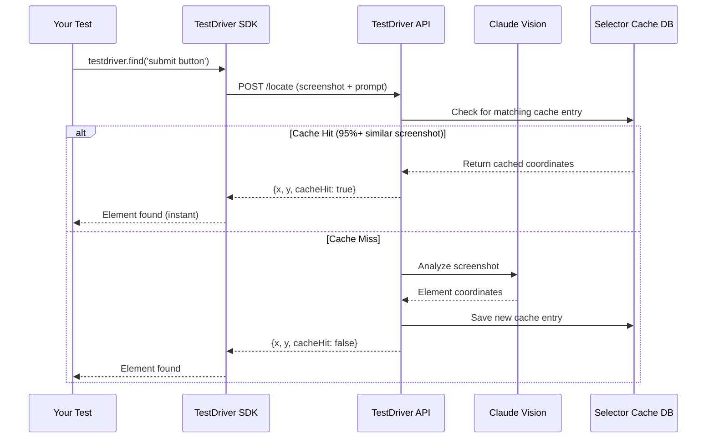

## Overview

TestDriver uses two types of caching to dramatically speed up your tests and reduce AI costs:

1. **Prompt Cache** - Caches AI-generated commands (`.ai()` responses)
2. **Selector Cache** - Caches element locations (`.find()` results)

Both caches are enabled by default and work automatically.

## Prompt Cache

The Prompt Cache stores AI-generated YAML commands locally, so repeated `.ai()` calls with the same prompt skip the AI entirely.

### How It Works

<Steps>
  <Step title="First Call">
    ```javascript
    await testdriver.ai('click the submit button');
    ```
    
    - Sends prompt + screenshot to AI
    - Receives YAML commands
    - Saves to `.testdriver/.cache/{prompt-hash}.yaml`
  </Step>
  
  <Step title="Subsequent Calls">
    ```javascript
    await testdriver.ai('click the submit button');
    ```
    
    - Checks cache first
    - Finds matching cached YAML
    - Uses cached commands (no AI call)
    - Shows `(using cached response)` in output
  </Step>
</Steps>

### Cache Location

Cached prompts are stored locally:

```
.testdriver/
  .cache/
    click-the-submit-button-a1b2c3d4.yaml
    find-login-form-e5f6a7b8.yaml
    verify-dashboard-c9d0e1f2.yaml
```

Files are named using:
- Sanitized prompt (first 50 chars, alphanumeric)
- MD5 hash of full prompt for uniqueness

### Disabling Prompt Cache

Bypass the cache for a specific call:

```javascript
// Force fresh AI call, bypass cache
await testdriver.ai('click the submit button', false);

// These use cache (default)
await testdriver.ai('click the submit button');
await testdriver.ai('click the submit button', true);
```

### Clearing Prompt Cache

Clear all cached prompts:

```bash
rm -rf .testdriver/.cache/*.yaml
```

Or programmatically:

```javascript
const promptCache = require('testdriverai/agent/lib/cache.js');
promptCache.clearCache();
```

### Benefits

- ⚡ **Instant execution** - No AI call needed
- 💰 **Cost savings** - Reduces API usage
- 🔌 **Offline testing** - Works without network
- 🎯 **Deterministic** - Same prompt = same commands

## Selector Cache

The Selector Cache stores element locations on the server, so `.find()` calls can skip the AI vision analysis.

### How It Works



### Cache Matching Strategy

The selector cache uses a three-tier matching system:

1. **Exact Hash Match** (Fastest)
   - Perceptual hash comparison
   - Same screenshot = instant match
   - 0% difference threshold

2. **Pixel Diff Match** (Fast)
   - 80%+ perceptual hash similarity
   - Pixel-by-pixel comparison
   - Default 5% difference threshold (95% similarity)
   - Configurable per call

3. **Template Match** (Fallback)
   - Edge detection + template matching
   - Finds visually similar UI elements
   - 75%+ confidence threshold

### Viewing Cache Entries

View all cached selectors at [console.testdriver.ai](https://console.testdriver.ai)

The console shows:
- Cached screenshots with green circles on found elements
- Original prompts
- Hit count (how many times cache was used)
- Similarity scores
- Cache age and last accessed time

### Controlling Cache Threshold

Adjust similarity threshold per call:

```javascript
// Default: 95% similarity (5% difference allowed)
await testdriver.find('submit button');

// Stricter: 99% similarity (1% difference allowed)
await testdriver.find('submit button', { threshold: 0.01 });

// More lenient: 90% similarity (10% difference allowed)
await testdriver.find('submit button', { threshold: 0.10 });

// Disable cache: force fresh AI analysis
await testdriver.find('submit button', { threshold: -1 });
```

### Cache Filtering

The selector cache automatically filters by:

- **Prompt** - Exact text match (case-insensitive)
- **Team** - Your team ID
- **OS** - Operating system (if specified)
- **Resolution** - Screen resolution (if specified)
- **Time Window** - Last 7 days by default

### Cache Statistics

Each cache entry tracks:

- **Hit Count** - Number of times cache was used
- **Last Hit** - When cache was last accessed
- **Similarity** - Percentage match to original
- **Created At** - When entry was created
- **Element Type** - button, input, link, etc.
- **Element Bounds** - Bounding box coordinates

### Benefits

- ⚡ **Up to 10x faster** - Skip AI vision analysis
- 💰 **Lower AI costs** - Fewer vision API calls
- 🎯 **Consistent results** - Same UI = same coordinates
- 📊 **Metrics tracking** - See cache hit rates in console

## Cache Behavior Examples

### Prompt Cache Example

```javascript
import { test } from 'vitest';
import { chrome } from 'testdriverai/presets';

test('login flow', async (context) => {
  const { testdriver } = await chrome(context, {
    url: 'https://myapp.com/login'
  });
  
  // First call: AI generates commands, saves to cache
  await testdriver.ai('click the login button');
  
  // Run test again - uses cache (instant)
  // Look for: "(using cached response)" in output
});
```

### Selector Cache Example

```javascript
import { test } from 'vitest';
import { chrome } from 'testdriverai/presets';

test('find element', async (context) => {
  const { testdriver } = await chrome(context, {
    url: 'https://example.com'
  });
  
  // First call: AI vision analysis, saves to cache
  const button = await testdriver.find('More information link');
  console.log('Cache hit:', button.cacheHit); // false
  
  // Second call: uses cache (instant)
  const button2 = await testdriver.find('More information link');
  console.log('Cache hit:', button2.cacheHit); // true
});
```

### Dynamic Threshold Example

```javascript
test('strict vs lenient matching', async (context) => {
  const { testdriver } = await chrome(context, { url });
  
  // Strict: 99% similarity required
  const elem1 = await testdriver.find('button', { threshold: 0.01 });
  
  // Lenient: 90% similarity acceptable
  const elem2 = await testdriver.find('button', { threshold: 0.10 });
  
  // Bypass cache entirely
  const elem3 = await testdriver.find('button', { threshold: -1 });
});
```

## Best Practices

### 1. Use Consistent Prompts

```javascript
// ✅ Good - consistent prompt
await testdriver.find('submit button');
await testdriver.find('submit button'); // Cache hit

// ❌ Bad - different prompts
await testdriver.find('submit button');
await testdriver.find('the submit button'); // Cache miss
```

### 2. Clear Cache When UI Changes

If your UI changes significantly, clear the cache:

```bash
# Clear prompt cache
rm -rf .testdriver/.cache/*.yaml

# Clear selector cache
# Use console.testdriver.ai to delete entries
```

### 3. Use Appropriate Thresholds

```javascript
// Stable UI: strict threshold
await testdriver.find('logo', { threshold: 0.01 });

// Dynamic UI: lenient threshold
await testdriver.find('news feed item', { threshold: 0.10 });

// Always fresh: disable cache
await testdriver.find('timestamp', { threshold: -1 });
```

### 4. Monitor Cache Performance

Check [console.testdriver.ai](https://console.testdriver.ai) regularly to:
- See cache hit rates
- Identify frequently used selectors
- Remove stale cache entries
- Optimize threshold settings

## Cache Storage

| Cache Type | Location | Persistence |
|------------|----------|-------------|
| Prompt Cache | Local (`.testdriver/.cache/`) | Until manually cleared |
| Selector Cache | Server (MongoDB + S3) | 7 days default |

## Important Notes

### Prompt Cache

- Cache keys are **prompt text only** (no screenshot comparison)
- Case-insensitive, trimmed matching
- Safe to commit to version control (but not recommended)
- Never expires automatically

### Selector Cache

- Cache matches by **screenshot similarity** + prompt
- Platform-specific (OS, resolution)
- Team-scoped (your cache entries only)
- 7-day rolling window by default

## Troubleshooting

### Prompt Cache Not Working

Check:
1. Prompts match exactly (case-insensitive)
2. `.testdriver/.cache/` directory exists and is writable
3. `TD_NO_PROMPT_CACHE` environment variable is not set

### Selector Cache Not Working

Check:
1. Threshold isn't too strict (try 0.10 for 90% similarity)
2. Screenshot hasn't changed significantly
3. OS/resolution matches cached entry
4. Cache entry isn't older than 7 days

### Stale Cache Data

Clear prompt cache:
```bash
rm -rf .testdriver/.cache/*.yaml
```

Delete selector cache entries at [console.testdriver.ai](https://console.testdriver.ai)

## See Also

- [Console Dashboard](https://console.testdriver.ai) - View and manage selector cache
- [`.ai()` Method](/v7/api/ai) - AI command generation
- [`.find()` Method](/v7/api/find) - Element location
- [Vitest Integration](/v7/guides/vitest) - Testing with TestDriver
