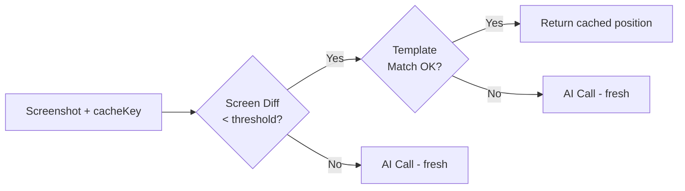

## Overview

The cache system speeds up repeated test runs by comparing screenshots to cached results. When the screen hasn't changed significantly, cached element positions are reused instead of making an AI call.

Cache works at two levels:
- **Screen cache** — pixel diff comparison between the current screenshot and the cached screenshot
- **Element cache** — OpenCV template matching to verify the cached element position is still correct

## How It Works

1. On `find()`, the SDK sends the current screenshot and cache metadata to the API
2. The API compares the screenshot against previously cached results for the same `cacheKey`
3. If the screen pixel diff is within the `screen` threshold AND the element template match exceeds the `element` threshold, the cached position is returned
4. Otherwise, a new AI call is made and the result is cached



## Configuration

### Constructor Options

```javascript
const testdriver = new TestDriver({
  cache: {
    enabled: true,
    thresholds: {
      find: {
        screen: 0.05,     // 5% pixel diff allowed (default)
        element: 0.8,     // 80% OpenCV correlation required (default)
      },
      assert: 0.05,       // 5% pixel diff for assertions (default)
    },
  },
  cacheKey: 'my-custom-key',   // overrides auto-generated key
});
```

<ParamField path="cache" type="CacheConfig | false">
  Cache configuration object, or `false` to disable entirely.

  <Expandable title="properties">
    <ParamField path="enabled" type="boolean" default={true}>
      Enable or disable the cache system. Requires a valid `cacheKey` to actually activate.
    </ParamField>
    
    <ParamField path="thresholds" type="CacheThresholds">
      Threshold configuration for different command types.

      <Expandable title="properties">
        <ParamField path="find" type="FindCacheThresholds">
          Thresholds for `find()` and `findAll()`.

          <Expandable title="properties">
            <ParamField path="screen" type="number" default={0.05}>
              Maximum pixel diff percentage allowed between the current screenshot and the cached screenshot. Lower values require a closer match. Range: `0` to `1`.
            </ParamField>
            
            <ParamField path="element" type="number" default={0.8}>
              Minimum OpenCV template matching correlation required for the cached element crop. Higher values require a closer match. Range: `0` to `1`. Only used for `find()`, not `findAll()`.
            </ParamField>
          </Expandable>
        </ParamField>
        
        <ParamField path="assert" type="number" default={0.05}>
          Maximum pixel diff allowed for assertion cache hits.
        </ParamField>
      </Expandable>
    </ParamField>
  </Expandable>
</ParamField>

<ParamField path="cacheKey" type="string">
  Unique key for cache lookups. If not provided, an auto-generated key is created from a SHA-256 hash of the calling test file (first 16 hex characters). The cache key changes automatically when your test file changes, providing automatic cache invalidation.
</ParamField>

### Disabling Cache

```javascript
// Via constructor
const testdriver = new TestDriver({ cache: false });

// Via environment variable
// TD_NO_CACHE=true npx vitest run
```

When cache is disabled, all thresholds are set to `-1` internally, causing the API to skip cache lookups.

### Per-Command Overrides

Override cache thresholds for individual commands:

```javascript
// Stricter screen matching for this specific find
const el = await testdriver.find('submit button', {
  cache: {
    thresholds: { screen: 0.01, element: 0.95 },
  },
});

// Custom cache key for a specific assertion
await testdriver.assert('dashboard loaded', {
  cache: { threshold: 0.01 },
  cacheKey: 'dashboard-check',
});
```

## Threshold Priority

Thresholds are resolved in priority order (highest wins):

| Priority | Source | Example |
|----------|--------|---------|
| 1 (highest) | Per-command option | `find(desc, { cache: { thresholds: { screen: 0.1 } } })` |
| 2 | Legacy number argument | `find(desc, 0.1)` |
| 3 | Global constructor config | `new TestDriver({ cache: { thresholds: { find: { screen: 0.1 } } } })` |
| 4 (lowest) | Hard-coded defaults | `screen: 0.05`, `element: 0.8`, `assert: 0.05` |

## Auto-Generated Cache Key

When you don't specify a `cacheKey`, the SDK automatically generates one:

1. Walks the call stack to find your test file
2. Reads the file content
3. Computes a **SHA-256 hash** of the content
4. Uses the **first 16 hex characters** as the cache key

This means:
- **Same test file** → same cache key → cache hits
- **Modified test file** → different hash → automatic cache invalidation
- **Different test files** → different keys → isolated caches

```javascript
// Auto-generated cache key from test file hash
const testdriver = new TestDriver();
// cacheKey = "a3f2b1c4d5e6f7a8" (auto)

// Manual override
const testdriver = new TestDriver({ cacheKey: 'login-test-v2' });
```

## Template Matching (OpenCV)

Element cache validation uses OpenCV's normalized cross-correlation coefficient (`TM_CCOEFF_NORMED`) to verify that the cached element is still visible at the expected position.

**Algorithm:**
1. Load the cached element crop (needle) and current screenshot (haystack)
2. Run `cv.matchTemplate()` with `TM_CCOEFF_NORMED`
3. Binary threshold at the configured element threshold
4. Find contours to extract match positions
5. Return matches with `{ x, y, width, height, centerX, centerY }`

**Scale factors tried:** `[1, 0.5, 2, 0.75, 1.25, 1.5]`
**Thresholds tried:** `[0.9, 0.8, 0.7]` (picks highest matching threshold)

This accounts for minor scaling differences between screenshots taken at different times or resolutions.

## Cache Partitioning

Cache entries are partitioned by:
- **`cacheKey`** — identifies the test file
- **`os`** — operating system (linux, windows, darwin)
- **`resolution`** — screen resolution

This means cache from a Linux run won't be used for a Windows run, even with the same cache key.

## Debugging Cache

API responses include cache metadata:

| Field | Description |
|---|---|
| `cacheHit` | `true` if cache was used |
| `similarity` | Pixel diff percentage between screenshots |
| `cacheSimilarity` | OpenCV template match score |

Use `getDebugInfo()` on an element to inspect cache results:

```javascript
const el = await testdriver.find('submit button');
const debug = el.getDebugInfo();
console.log(debug);
// { cacheHit: true, similarity: 0.02, cacheSimilarity: 0.92, ... }
```

## Types

```typescript
interface CacheConfig {
  enabled?: boolean;            // Default: true
  thresholds?: CacheThresholds;
}

interface CacheThresholds {
  find?: FindCacheThresholds;
  assert?: number;              // Default: 0.05
}

interface FindCacheThresholds {
  screen?: number;              // Default: 0.05
  element?: number;             // Default: 0.8
}

interface CacheDebugInfo {
  cacheHit: boolean;
  similarity: number;
  cacheSimilarity: number;
}
```
