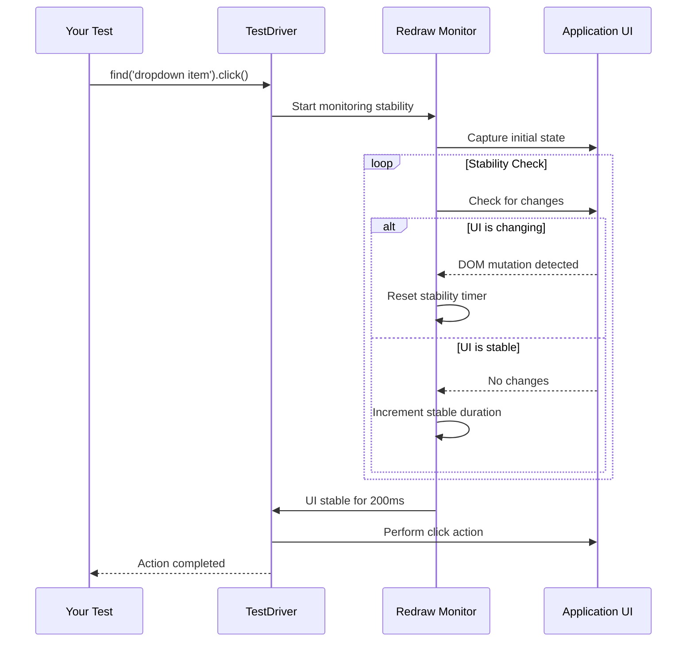

Test flakiness is the bane of CI/CD pipelines. TestDriver eliminates flaky tests with built-in anti-flake technology that automatically handles timing issues, animations, and dynamic content.

## The Flaky Test Problem

Traditional test frameworks suffer from race conditions and timing issues:

<CodeGroup>
```javascript Traditional - Flaky
// ❌ May fail randomly
await page.click('button');
await page.click('.dropdown-item'); // Element might not be ready!

// ❌ Arbitrary waits
await page.click('button');
await page.waitForTimeout(1000); // Hope 1 second is enough
await page.click('.dropdown-item');

// ❌ Complex wait logic
await page.click('button');
await page.waitForSelector('.dropdown-item', {
  state: 'visible',
  timeout: 5000
});
await page.waitForLoadState('networkidle');
await page.waitForTimeout(200); // Still need extra buffer!
await page.click('.dropdown-item');
```

```javascript TestDriver - Stable
// ✅ Just works
await testdriver.find('button').click();
await testdriver.find('dropdown item').click();
// TestDriver automatically waits for stability
```
</CodeGroup>

<Check>
  TestDriver handles all timing automatically. No explicit waits, no arbitrary timeouts, no flaky tests.
</Check>

## Redraw Detection

TestDriver's redraw detection system automatically waits for the UI to stabilize before taking any action.

<Card title="What Redraw Detects" icon="eye">
  The system monitors multiple stability signals:

  - **DOM Mutations** - Element additions, removals, or attribute changes
  - **Layout Reflows** - Position or size changes
  - **CSS Animations** - Running animations and transitions
  - **Network Activity** - Pending XHR/fetch requests
  - **Visual Changes** - Pixel-level screenshot differences
  - **Loading Indicators** - Spinners, progress bars, skeleton screens
</Card>

### How It Works



### Configurable Stability

Fine-tune stability detection for your application's needs:

```javascript
// Default stability settings (recommended)
await testdriver.find('button').click();

// Custom stability delay
await testdriver.find('animated button', {
  stabilityDelay: 500 // Wait 500ms of stability before acting
}).click();

// Bypass stability (advanced)
await testdriver.find('element', {
  stabilityDelay: 0 // Act immediately
}).click();
```

<Tip>
  The default 200ms stability delay works for 95% of applications. Only adjust if you have unusually long animations or need instant actions.
</Tip>

## Network Monitoring

TestDriver waits for network activity to complete before asserting or locating elements:

<AccordionGroup>
  <Accordion title="Automatic Network Waiting">
    ```javascript
    // TestDriver automatically waits for:
    // 1. Pending XHR/fetch requests to complete
    // 2. WebSocket messages to be processed
    // 3. Image/asset loading to finish

    await testdriver.find('submit button').click();
    // ↑ Triggers API call

    await testdriver.assert('Success message is visible');
    // ↑ Automatically waits for API response before asserting
    ```

    No need for manual `waitForResponse` or `waitForLoadState` calls.
  </Accordion>

  <Accordion title="Loading Indicator Detection">
    ```javascript
    // TestDriver detects common loading patterns:
    await testdriver.find('Load More button').click();

    // Automatically waits for:
    // - Loading spinner to appear and disappear
    // - Skeleton screens to be replaced
    // - Progress bars to complete
    // - "Loading..." text to disappear

    await testdriver.find('newly loaded content').click();
    ```

    Common loading indicators are recognized and waited for automatically.
  </Accordion>

  <Accordion title="Custom Network Conditions">
    ```javascript
    // For slow networks or long-running requests
    await testdriver.find('submit button', {
      timeout: 60000, // Wait up to 60 seconds
      networkTimeout: 30000 // Allow 30s for network requests
    }).click();
    ```
  </Accordion>
</AccordionGroup>

## Screen Stability Monitoring

Visual stability is critical for reliable element location:

```javascript
// TestDriver monitors pixel-level changes
await testdriver.find('animated element').click();

// Waits for:
// ✓ CSS animations to complete
// ✓ Fade-in/fade-out effects to finish
// ✓ Slide transitions to settle
// ✓ Scroll animations to stop
// ✓ Dynamic content to load
```

<Card title="Example: Accordion Animation" icon="angles-down">
  ```javascript
  // Traditional approach - prone to failure
  await page.click('.accordion-header');
  await page.waitForTimeout(300); // Hope animation is done
  await page.click('.accordion-content button'); // Might fail!

  // TestDriver - just works
  await testdriver.find('accordion header').click();
  await testdriver.find('button inside accordion content').click();
  // ✅ Automatically waits for accordion animation to complete
  ```
</Card>

## Retry Logic

TestDriver includes intelligent retry logic that adapts to your application:

<Steps>
  <Step title="Initial Attempt">
    Try to locate the element immediately.

    ```javascript
    const element = await testdriver.find('button');
    // Attempts location immediately
    ```
  </Step>

  <Step title="Wait for Stability">
    If not found, wait for UI stability and retry.

    ```javascript
    // Waits for:
    // - DOM mutations to stop
    // - Network requests to complete
    // - Animations to finish
    ```
  </Step>

  <Step title="Retry with Interval">
    Continue retrying at regular intervals until timeout.

    ```javascript
    await testdriver.find('button', {
      timeout: 30000,      // Try for up to 30 seconds
      retryInterval: 500   // Check every 500ms
    });
    ```
  </Step>

  <Step title="Provide Debug Info">
    If still not found, provide detailed debugging information.

    ```javascript
    try {
      await testdriver.find('missing button');
    } catch (error) {
      console.log('Debug screenshot:', error.debugScreenshot);
      console.log('Similarity score:', error.similarity);
      console.log('Cache info:', error.cacheInfo);
    }
    ```
  </Step>
</Steps>

## Configurable Timeouts

Customize retry behavior for different scenarios:

<Tabs>
  <Tab title="Fast Elements">
    ```javascript
    // For elements that appear quickly
    await testdriver.find('header logo', {
      timeout: 5000 // 5 seconds (faster failure)
    });
    ```
  </Tab>

  <Tab title="Slow Elements">
    ```javascript
    // For elements that take time to load
    await testdriver.find('search results', {
      timeout: 30000, // 30 seconds
      retryInterval: 1000 // Check every second
    });
    ```
  </Tab>

  <Tab title="Critical Elements">
    ```javascript
    // For absolutely critical elements
    await testdriver.find('payment confirmation', {
      timeout: 60000, // 1 minute
      retryInterval: 2000, // Check every 2 seconds
      stabilityDelay: 1000 // Wait 1 second of stability
    });
    ```
  </Tab>
</Tabs>

## Real-World Stability Improvements

Compare flake rates before and after TestDriver:

<CardGroup cols={2}>
  <Card title="Before TestDriver" icon="triangle-exclamation">
    ```
    Test Suite: E2E Tests
    Total: 100 tests
    Passed: 87
    Failed: 13

    Flaky tests:
    - login_test (timing)
    - dropdown_test (animation)
    - modal_test (async content)
    - search_test (debounce)

    Flake rate: 13%
    CI reruns needed: 3-5x
    ```
  </Card>

  <Card title="After TestDriver" icon="circle-check">
    ```
    Test Suite: E2E Tests
    Total: 100 tests
    Passed: 100
    Failed: 0

    Flaky tests: None

    Flake rate: 0%
    CI reruns needed: 0
    Stable builds: 100%
    ```
  </Card>
</CardGroup>

<Check>
  **Result: 100% stability** - Eliminated all flaky tests without changing test code.
</Check>

## Advanced: Redraw Configuration

The redraw system is configurable through [redraw.js](/agent/lib/redraw.js):

```javascript
// Global redraw settings
const testdriver = new TestDriver({
  apiKey: process.env.TD_API_KEY,
  redraw: {
    enabled: true,
    stabilityDelay: 200,      // Default stability wait (ms)
    maxStabilityWait: 5000,   // Maximum time to wait for stability
    checkInterval: 50,        // How often to check for stability
    networkIdle: true,        // Wait for network idle
    domIdle: true,            // Wait for DOM mutations to stop
    animationIdle: true,      // Wait for CSS animations
  }
});
```

### Per-Action Configuration

```javascript
// Override redraw settings for specific actions
await testdriver.find('fast element', {
  redraw: {
    enabled: false // Skip redraw detection
  }
}).click();

await testdriver.find('slow element', {
  redraw: {
    stabilityDelay: 1000, // Wait longer for stability
    networkIdle: true
  }
}).click();
```

## Debugging Stability Issues

If you encounter stability issues, TestDriver provides detailed diagnostics:

```javascript
try {
  await testdriver.find('unstable element', {
    debug: true // Enable debug logging
  });
} catch (error) {
  console.log('Stability info:', error.stabilityInfo);
  // Output:
  // {
  //   domMutations: 15,
  //   layoutReflows: 3,
  //   networkRequests: 2,
  //   animations: ['fade-in', 'slide-up'],
  //   waitedMs: 5000,
  //   stableMs: 150
  // }
}
```

## Common Stability Patterns

<AccordionGroup>
  <Accordion title="Dropdown Menus">
    ```javascript
    // Traditional - flaky
    await page.click('.menu-button');
    await page.waitForTimeout(200);
    await page.click('.menu-item');

    // TestDriver - stable
    await testdriver.find('menu button').click();
    await testdriver.find('menu item').click();
    ```
  </Accordion>

  <Accordion title="Modal Dialogs">
    ```javascript
    // Traditional - flaky
    await page.click('.open-modal');
    await page.waitForSelector('.modal', { state: 'visible' });
    await page.waitForTimeout(300); // Wait for animation
    await page.click('.modal-button');

    // TestDriver - stable
    await testdriver.find('open modal button').click();
    await testdriver.find('modal button').click();
    ```
  </Accordion>

  <Accordion title="Infinite Scroll">
    ```javascript
    // Traditional - flaky
    await page.evaluate(() => window.scrollTo(0, document.body.scrollHeight));
    await page.waitForTimeout(1000);
    await page.waitForLoadState('networkidle');
    await page.click('.load-more');

    // TestDriver - stable
    await testdriver.scroll('down', 1000);
    await testdriver.find('load more button').click();
    ```
  </Accordion>

  <Accordion title="Form Submissions">
    ```javascript
    // Traditional - flaky
    await page.fill('input[name="email"]', 'user@example.com');
    await page.click('button[type="submit"]');
    await page.waitForNavigation();
    await page.waitForTimeout(500);

    // TestDriver - stable
    await testdriver.find('email input').type('user@example.com');
    await testdriver.find('submit button').click();
    await testdriver.assert('success message is visible');
    ```
  </Accordion>
</AccordionGroup>

## Best Practices

<Card title="Let TestDriver Handle Timing" icon="clock">
  **Don't:**
  ```javascript
  await testdriver.find('button').click();
  await new Promise(resolve => setTimeout(resolve, 1000)); // ❌
  ```

  **Do:**
  ```javascript
  await testdriver.find('button').click();
  await testdriver.find('next element').click(); // ✅
  ```

  Trust TestDriver's automatic stability detection.
</Card>

<Card title="Use Natural Assertions" icon="check">
  **Don't:**
  ```javascript
  await testdriver.find('button').click();
  const element = await testdriver.find('result');
  expect(element).toBeTruthy(); // ❌ Redundant
  ```

  **Do:**
  ```javascript
  await testdriver.find('button').click();
  await testdriver.assert('result is visible'); // ✅ Natural
  ```

  TestDriver's assert automatically waits for stability.
</Card>

## Learn More

<CardGroup cols={2}>
  <Card
    title="Redraw Implementation"
    icon="code"
    href="/agent/lib/redraw.js"
  >
    View the redraw detection source code
  </Card>

  <Card
    title="Error Handling Guide"
    icon="triangle-exclamation"
    href="/v7/guides/error-handling"
  >
    Learn about error handling patterns
  </Card>

  <Card
    title="Best Practices"
    icon="star"
    href="/v7/guides/best-practices"
  >
    Testing best practices with TestDriver
  </Card>

  <Card
    title="Debugging Guide"
    icon="bug"
    href="/v7/guides/debugging"
  >
    Debug failing tests effectively
  </Card>
</CardGroup>
