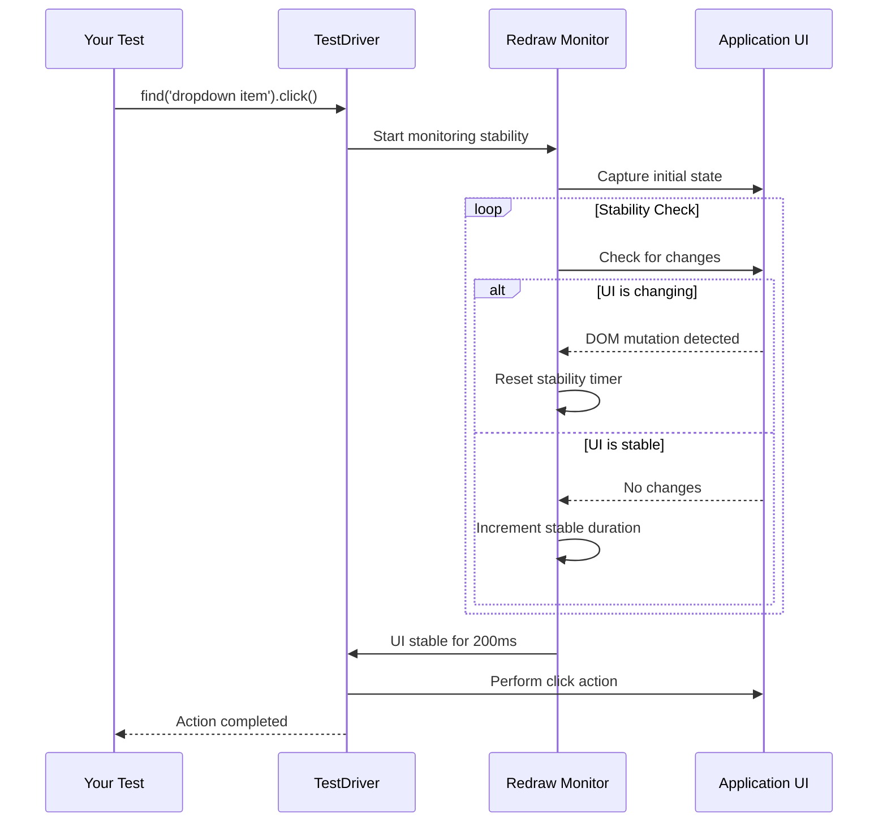

Test flakiness is the bane of CI/CD pipelines. TestDriver eliminates flaky tests with built-in anti-flake technology that automatically handles timing issues, animations, and dynamic content.

## The Flaky Test Problem

Traditional test frameworks suffer from race conditions and timing issues:

<CodeGroup>
```javascript Traditional - Flaky
// ❌ May fail randomly
await page.click('button');
await page.click('.dropdown-item'); // Element might not be ready!

// ❌ Arbitrary waits
await page.click('button');
await page.waitForTimeout(1000); // Hope 1 second is enough
await page.click('.dropdown-item');

// ❌ Complex wait logic
await page.click('button');
await page.waitForSelector('.dropdown-item', {
  state: 'visible',
  timeout: 5000
});
await page.waitForLoadState('networkidle');
await page.waitForTimeout(200); // Still need extra buffer!
await page.click('.dropdown-item');
```

```javascript TestDriver - Stable
// ✅ Just works
await testdriver.find('button').click();
await testdriver.find('dropdown item').click();
// TestDriver automatically waits for stability
```
</CodeGroup>

<Check>
  TestDriver handles all timing automatically. No explicit waits, no arbitrary timeouts, no flaky tests.
</Check>

## Redraw Detection

TestDriver's redraw detection system automatically waits for the UI to stabilize before taking any action.

<Card title="What Redraw Detects" icon="eye">
  The system monitors multiple stability signals:

  - **Layout Reflows** - Position or size changes
  - **CSS Animations** - Running animations and transitions
  - **Network Activity** - Pending XHR/fetch requests
  - **Visual Changes** - Pixel-level screenshot differences
  - **Loading Indicators** - Spinners, progress bars, skeleton screens
</Card>

### How It Works



### Configurable Stability

Fine-tune stability detection for your application's needs:

```javascript
// Default stability settings (recommended)
await testdriver.find('button').click();

// Disable redraw detection for specific actions (advanced)
await testdriver.find('element', {
  redraw: {
    enabled: false // Skip stability detection
  }
}).click();

// Disable only screen monitoring (keep network monitoring)
await testdriver.find('animated element', {
  redraw: {
    screenRedraw: false // Skip screen stability, still wait for network
  }
}).click();
```

<Tip>
  The default redraw settings work for 95% of applications. Only adjust if you have unusually subtle animations or need to bypass stability checks.
</Tip>

## Network Monitoring

TestDriver waits for network activity to complete before asserting or locating elements:

<AccordionGroup>
  <Accordion title="Automatic Network Waiting">
    ```javascript
    // TestDriver automatically waits for:
    // 1. Pending XHR/fetch requests to complete
    // 2. WebSocket messages to be processed
    // 3. Image/asset loading to finish

    await testdriver.find('submit button').click();
    // ↑ Triggers API call

    await testdriver.assert('Success message is visible');
    // ↑ Automatically waits for API response before asserting
    ```

    No need for manual `waitForResponse` or `waitForLoadState` calls.
  </Accordion>

  <Accordion title="Loading Indicator Detection">
    ```javascript
    // TestDriver detects common loading patterns:
    await testdriver.find('Load More button').click();

    // Automatically waits for:
    // - Loading spinner to appear and disappear
    // - Skeleton screens to be replaced
    // - Progress bars to complete
    // - "Loading..." text to disappear

    await testdriver.find('newly loaded content').click();
    ```

    Common loading indicators are recognized and waited for automatically.
  </Accordion>

  <Accordion title="Custom Polling for Slow Elements">
    ```javascript
    // For elements that take time to appear, use polling
    async function waitForElement(description, timeoutMs = 60000) {
      const startTime = Date.now();
      while (Date.now() - startTime < timeoutMs) {
        const element = await testdriver.find(description);
        if (element.found()) return element;
        await new Promise(r => setTimeout(r, 1000));
      }
      throw new Error(`Element "${description}" not found`);
    }
    
    const button = await waitForElement('submit button');
    await button.click();
    ```
  </Accordion>
</AccordionGroup>

## Screen Stability Monitoring

Visual stability is critical for reliable element location:

```javascript
// TestDriver monitors pixel-level changes
await testdriver.find('animated element').click();

// Waits for:
// ✓ CSS animations to complete
// ✓ Fade-in/fade-out effects to finish
// ✓ Slide transitions to settle
// ✓ Scroll animations to stop
// ✓ Dynamic content to load
```

<Card title="Example: Accordion Animation" icon="angles-down">
  ```javascript
  // Traditional approach - prone to failure
  await page.click('.accordion-header');
  await page.waitForTimeout(300); // Hope animation is done
  await page.click('.accordion-content button'); // Might fail!

  // TestDriver - just works
  await testdriver.find('accordion header').click();
  await testdriver.find('button inside accordion content').click();
  // ✅ Automatically waits for accordion animation to complete
  ```
</Card>

## Debugging Element Location

When elements aren't found, TestDriver provides detailed debugging information to help you understand why:

<Steps>
  <Step title="Check Element Existence">
    Verify if the element was found before interacting with it.

    ```javascript
    const element = await testdriver.find('button');
    if (element.found()) {
      await element.click();
    } else {
      console.log('Button not found on page');
    }
    ```
  </Step>

  <Step title="Review Debug Information">
    Access detailed debugging data from the element response.

    ```javascript
    const element = await testdriver.find('submit button');
    
    console.log('Found:', element.found());
    console.log('Similarity:', element.aiResponse?.similarity);
    console.log('Cache hit:', element.aiResponse?.cacheHit);
    console.log('Screenshot:', element.screenshotPath);
    ```
  </Step>

  <Step title="Analyze Visual Differences">
    Compare what TestDriver saw vs. what you expected.

    ```javascript
    const element = await testdriver.find('login button');
    
    if (!element.found()) {
      // Screenshot shows what TestDriver analyzed
      console.log('Check screenshot:', element.screenshotPath);
      
      // Similarity score indicates how close it got
      console.log('Best match similarity:', element.aiResponse?.similarity);
      
      // Review the description for clarity
      console.log('Search description:', 'login button');
    }
    ```
  </Step>

  <Step title="Refine Your Description">
    Use debug insights to improve element descriptions.

    ```javascript
    // Too vague
    const btn = await testdriver.find('button');
    
    // Better - more specific
    const loginBtn = await testdriver.find('blue login button in header');
    
    // Best - unique identifying features
    const submitBtn = await testdriver.find('submit button with arrow icon');
    ```
  </Step>
</Steps>

## Polling for Dynamic Elements

For elements that may take time to appear, implement polling:

```javascript
// Standard polling for normal elements
const timeoutMs = 30000; // 30 seconds
const startTime = Date.now();
let results;

while (Date.now() - startTime < timeoutMs) {
  results = await testdriver.find('search results');
  if (results.found()) break;
  await new Promise(r => setTimeout(r, 1000)); // Check every second
}

if (results.found()) {
  await results.click();
}
```

## Advanced: Redraw Configuration

The redraw system is configurable through [redraw.js](/agent/lib/redraw.js):

```javascript
// Global redraw settings
const testdriver = new TestDriver({
  apiKey: process.env.TD_API_KEY,
  redraw: {
    enabled: true,            // Master switch for redraw detection
    screenRedraw: true,       // Enable screen stability detection
    networkMonitor: true,     // Enable network activity monitoring
  }
});
```

### Per-Action Configuration

```javascript
// Override redraw settings for specific actions
await testdriver.find('fast element', {
  redraw: {
    enabled: false // Skip redraw detection entirely
  }
}).click();

await testdriver.find('element with animation', {
  redraw: {
    screenRedraw: false, // Skip screen stability check
    networkMonitor: true // Still wait for network to settle
  }
}).click();
```

## Debugging Stability Issues

If you encounter stability issues, TestDriver provides detailed diagnostics:

```javascript
// Enable verbose logging to see redraw detection in action
const testdriver = new TestDriver({
  apiKey: process.env.TD_API_KEY,
  verbosity: 2 // Show detailed redraw logs
});

await testdriver.find('element').click();
// Console output will show:
// [redraw] Screen diff: 0.15%
// [redraw] Network activity: 1250 b/s
// [redraw] Waiting for stability...
```

## Common Stability Patterns

<AccordionGroup>
  <Accordion title="Dropdown Menus">
    ```javascript
    // Traditional - flaky
    await page.click('.menu-button');
    await page.waitForTimeout(200);
    await page.click('.menu-item');

    // TestDriver - stable
    await testdriver.find('menu button').click();
    await testdriver.find('menu item').click();
    ```
  </Accordion>

  <Accordion title="Modal Dialogs">
    ```javascript
    // Traditional - flaky
    await page.click('.open-modal');
    await page.waitForSelector('.modal', { state: 'visible' });
    await page.waitForTimeout(300); // Wait for animation
    await page.click('.modal-button');

    // TestDriver - stable
    await testdriver.find('open modal button').click();
    await testdriver.find('modal button').click();
    ```
  </Accordion>

  <Accordion title="Infinite Scroll">
    ```javascript
    // Traditional - flaky
    await page.evaluate(() => window.scrollTo(0, document.body.scrollHeight));
    await page.waitForTimeout(1000);
    await page.waitForLoadState('networkidle');
    await page.click('.load-more');

    // TestDriver - stable
    await testdriver.scroll('down', 1000);
    await testdriver.find('load more button').click();
    ```
  </Accordion>

  <Accordion title="Form Submissions">
    ```javascript
    // Traditional - flaky
    await page.fill('input[name="email"]', 'user@example.com');
    await page.click('button[type="submit"]');
    await page.waitForNavigation();
    await page.waitForTimeout(500);

    // TestDriver - stable
    await testdriver.find('email input').type('user@example.com');
    await testdriver.find('submit button').click();
    await testdriver.assert('success message is visible');
    ```
  </Accordion>
</AccordionGroup>

## Best Practices

<Card title="Let TestDriver Handle Timing" icon="clock">
  Don't:
  ```javascript
  await testdriver.find('button').click();
  await new Promise(resolve => setTimeout(resolve, 1000)); // ❌
  ```

  Do:
  ```javascript
  await testdriver.find('button').click();
  await testdriver.find('next element').click(); // ✅
  ```

  Trust TestDriver's automatic stability detection.
</Card>

<Card title="Use Natural Assertions" icon="check">
  Don't:
  ```javascript
  await testdriver.find('button').click();
  const element = await testdriver.find('result');
  expect(element).toBeTruthy(); // ❌ Redundant
  ```

  Do:
  ```javascript
  await testdriver.find('button').click();
  await testdriver.assert('result is visible'); // ✅ Natural
  ```

  TestDriver's assert automatically waits for stability.
</Card>

## Learn More

<CardGroup cols={2}>
  <Card
    title="Redraw Implementation"
    icon="code"
    href="/agent/lib/redraw.js"
  >
    View the redraw detection source code
  </Card>

  <Card
    title="Error Handling Guide"
    icon="triangle-exclamation"
    href="/v7/guides/error-handling"
  >
    Learn about error handling patterns
  </Card>

  <Card
    title="Best Practices"
    icon="star"
    href="/v7/guides/best-practices"
  >
    Testing best practices with TestDriver
  </Card>

  <Card
    title="Debugging Guide"
    icon="bug"
    href="/v7/guides/debugging"
  >
    Debug failing tests effectively
  </Card>
</CardGroup>
