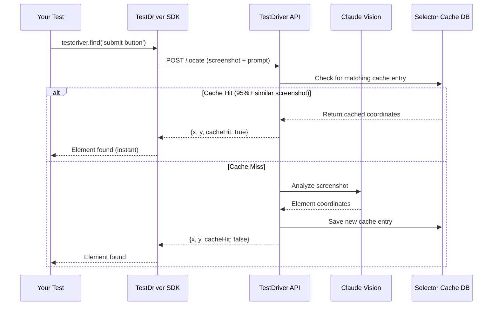

## Overview

The Selector Cache stores element locations on the server, so `.find()` calls can skip the AI vision analysis.

This provides:
- ⚡ **Up to 10x faster** - Skip AI vision analysis
- 💰 **Lower AI costs** - Fewer vision API calls
- 🎯 **Consistent results** - Same UI = same coordinates
- 📊 **Metrics tracking** - See cache hit rates in console

## How It Works



## Cache Matching Strategy

The selector cache uses a three-tier matching system:

1. **Exact Hash Match** (Fastest)
   - Perceptual hash comparison
   - Same screenshot = instant match
   - 0% difference threshold

2. **Pixel Diff Match** (Fast)
   - 80%+ perceptual hash similarity
   - Pixel-by-pixel comparison
   - Default 5% difference threshold (95% similarity)
   - Configurable per call

3. **Template Match** (Fallback)
   - Edge detection + template matching
   - Finds visually similar UI elements
   - 75%+ confidence threshold

## Controlling Cache Threshold

Adjust similarity threshold per call:

```javascript
// Default: 95% similarity (5% difference allowed)
await testdriver.find('submit button');

// Stricter: 99% similarity (1% difference allowed)
await testdriver.find('submit button', { threshold: 0.01 });

// More lenient: 90% similarity (10% difference allowed)
await testdriver.find('submit button', { threshold: 0.10 });

// Disable cache: force fresh AI analysis
await testdriver.find('submit button', { threshold: -1 });
```

## Cache Filtering

The selector cache automatically filters by:

- **Prompt** - Exact text match (case-insensitive)
- **Team** - Your team ID
- **OS** - Operating system (if specified)
- **Resolution** - Screen resolution (if specified)
- **Time Window** - Last 7 days by default

## Viewing Cache Entries

View all cached selectors at [console.testdriver.ai](https://console.testdriver.ai)

The console shows:
- Cached screenshots with green circles on found elements
- Original prompts
- Hit count (how many times cache was used)
- Similarity scores
- Cache age and last accessed time

## Cache Statistics

Each cache entry tracks:

- **Hit Count** - Number of times cache was used
- **Last Hit** - When cache was last accessed
- **Similarity** - Percentage match to original
- **Created At** - When entry was created
- **Element Type** - button, input, link, etc.
- **Element Bounds** - Bounding box coordinates

## Usage Examples

### Basic Selector Caching

```javascript
import { test } from 'vitest';
import { chrome } from 'testdriverai/presets';

test('find element', async (context) => {
  const { testdriver } = await chrome(context, {
    url: 'https://example.com'
  });
  
  // First call: AI vision analysis, saves to cache
  const button = await testdriver.find('More information link');
  console.log('Cache hit:', button.cacheHit); // false
  
  // Second call: uses cache (instant)
  const button2 = await testdriver.find('More information link');
  console.log('Cache hit:', button2.cacheHit); // true
});
```

### Dynamic Threshold Example

```javascript
test('strict vs lenient matching', async (context) => {
  const { testdriver } = await chrome(context, { url });
  
  // Strict: 99% similarity required
  const elem1 = await testdriver.find('button', { threshold: 0.01 });
  
  // Lenient: 90% similarity acceptable
  const elem2 = await testdriver.find('button', { threshold: 0.10 });
  
  // Bypass cache entirely
  const elem3 = await testdriver.find('button', { threshold: -1 });
});
```

### Checking Cache Hits

```javascript
test('monitor cache performance', async (context) => {
  const { testdriver } = await chrome(context, { url });
  
  const element = await testdriver.find('submit button');
  
  if (element.cacheHit) {
    console.log('✅ Cache hit - instant response');
  } else {
    console.log('⏱️  Cache miss - AI analysis performed');
  }
});
```

## Best Practices

### 1. Use Appropriate Thresholds

```javascript
// Stable UI: strict threshold
await testdriver.find('logo', { threshold: 0.01 });

// Dynamic UI: lenient threshold
await testdriver.find('news feed item', { threshold: 0.10 });

// Always fresh: disable cache
await testdriver.find('timestamp', { threshold: -1 });
```

### 2. Monitor Cache Performance

Check [console.testdriver.ai](https://console.testdriver.ai) regularly to:
- See cache hit rates
- Identify frequently used selectors
- Remove stale cache entries
- Optimize threshold settings

### 3. Clear Cache When UI Changes

If your UI changes significantly, delete cache entries through the console dashboard.

### 4. Use Consistent Prompts

```javascript
// ✅ Good - consistent prompt
await testdriver.find('submit button');
await testdriver.find('submit button'); // Cache hit

// ❌ Bad - different prompts
await testdriver.find('submit button');
await testdriver.find('the submit button'); // Cache miss
```

## Cache Storage Details

| Property | Value |
|----------|-------|
| Location | Server (MongoDB + S3) |
| Persistence | 7 days default |
| Scope | Per-team |
| Matching | Screenshot similarity + prompt |
| Expiration | 7-day rolling window |

## Troubleshooting

### Cache Not Working

Check:
1. Threshold isn't too strict (try 0.10 for 90% similarity)
2. Screenshot hasn't changed significantly
3. OS/resolution matches cached entry
4. Cache entry isn't older than 7 days
5. Prompt matches exactly (case-insensitive)

### Low Cache Hit Rate

If you're seeing low cache hit rates:

1. **Increase threshold** - Try 0.10 (90% similarity) for dynamic UIs
2. **Stabilize UI** - Minimize animations, random data, timestamps
3. **Use consistent prompts** - Same wording every time
4. **Check console** - View similarity scores in dashboard

### Stale Cache Data

Delete selector cache entries at [console.testdriver.ai](https://console.testdriver.ai)

- Find the cached entry by prompt or screenshot
- Click delete to remove stale entries
- Run test again to create fresh cache

### Cache Misses on Identical UI

If cache misses occur on seemingly identical screens:

1. **Check resolution** - Cache is resolution-specific
2. **Check OS** - Cache is platform-specific
3. **Check pixel differences** - Even 1px changes can cause misses with strict thresholds
4. **Increase threshold** - Allow more similarity variance

## Advanced Configuration

### Environment Variables

```bash
# Disable selector cache entirely
TD_NO_SELECTOR_CACHE=1

# Set default threshold globally
TD_DEFAULT_THRESHOLD=0.10
```

### Per-Test Configuration

```javascript
test('custom cache settings', async (context) => {
  const { testdriver } = await chrome(context, {
    url,
    cacheDefaults: {
      threshold: 0.10,  // 90% similarity
      enabled: true
    }
  });
  
  // Uses custom defaults
  await testdriver.find('button');
});
```

## See Also

- [AI Prompt Caching](/v7/guides/caching-ai) - Cache AI-generated YAML
- [Console Dashboard](https://console.testdriver.ai) - View and manage selector cache
- [`.find()` Method](/v7/api/find) - Element location
- [Vitest Integration](/v7/guides/vitest) - Testing with TestDriver
