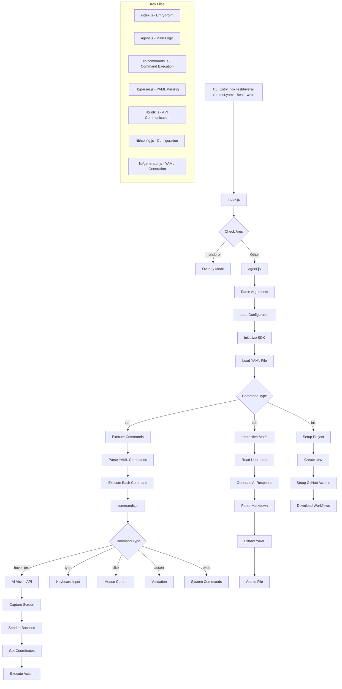
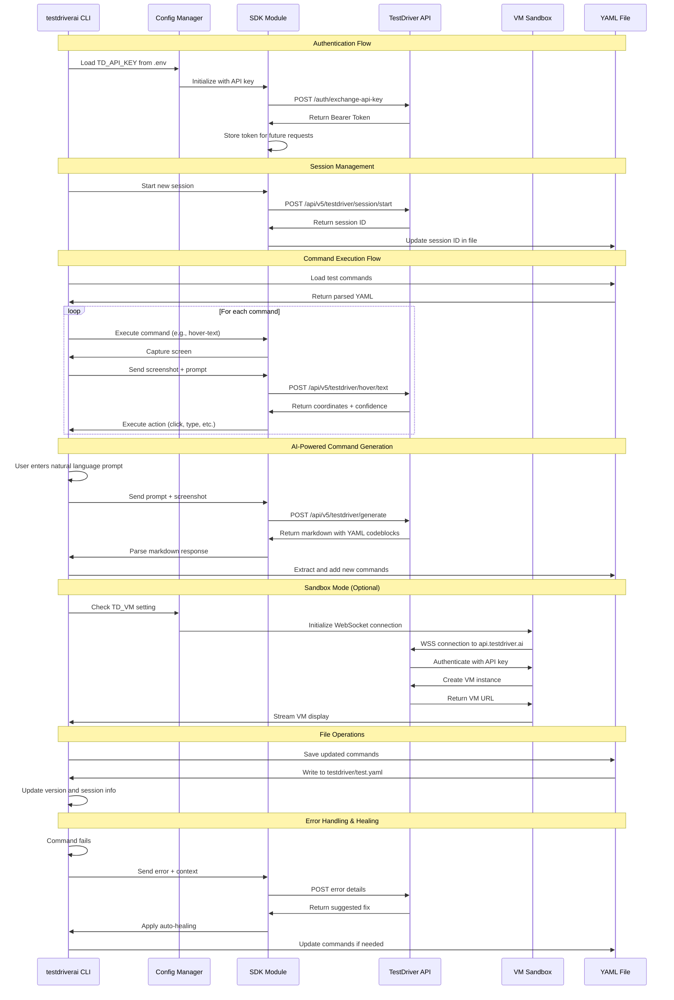

# Contributing

## Setup `testdriverai` repo

1. `gh repo clone testdriverai/testdriverai`
1. `npm install` project dependencies
1. `npm link`

## Setting up a Test Project

1. `cd $(mktemp -d)` to create a blank project
1. `npm link testdriverai`
1. `npx testdriverai init`

   > Spawning GUI...
   > Howdy! I'm TestDriver v4.2.29
   > Working on **/private/var/folders/4w/\_l20wtfj41n2dx0xyhb8xd740000gn/T/tmp.PDxTlOLJBS/testdriver/testdriver.yml**
   > ...

1. `npx testdriverai testdriver/test.yml`

## Architecture Diagram



## Network Diagram



## Testing against local `api`

When running [replayableio/api](https://github.com/replayableio/api/) locally, specify `TD_API_ROOT` in your `.env` file or shell:

```sh
TD_API_ROOT=http://localhost:1337 npx testdriverai
```

## Logging

- `DEV` to log the config
- `VERBOSE` to log `logger.debug` (Default: `logger.info` and above)

```sh
DEV=true VERBOSE=true npx testdriverai
```

## Debugging with Chrome Node Inspector

> https://nodejs.org/en/learn/getting-started/debugging

```sh
npx --node-options=--inspect testdriverai init
```

## Event Principles

- Events represent changes to the state of the system
- Execution is functional and should not be mutated by events
