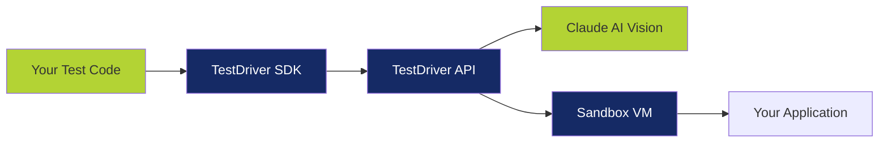

TestDriver is an AI-native testing platform that lets you write tests in natural language. It uses computer vision and AI to understand your application like a human would, eliminating brittle selectors and making tests easy to write and maintain.

## The Problem with Traditional Testing

Traditional E2E testing tools require:

<CardGroup cols={1}>
  <Card title="Brittle Selectors" icon="triangle-exclamation">
    ```javascript
    // ❌ Breaks when DOM changes
    await page.click('#root > div > form > div:nth-child(2) > button')
    ```
  </Card>

  <Card title="Flaky Tests" icon="shuffle">
    ```javascript
    // ❌ Arbitrary waits
    await page.click('button')
    await page.waitForTimeout(1000)
    await page.click('.dropdown-item')
    ```
  </Card>

  <Card title="Limited Scope" icon="ban">
    Most tools only work for web browsers. Testing desktop apps, extensions, or IDEs requires completely different frameworks.
  </Card>
</CardGroup>

## The TestDriver Solution

TestDriver solves these problems with AI-powered testing:

<CodeGroup>
```javascript TestDriver - Natural & Simple
import { test } from 'vitest';
import { chrome } from 'testdriverai/presets';

test('user can login', async (context) => {
  const { testdriver } = await chrome(context, {
    url: 'https://myapp.com/login'
  });

  await testdriver.find('email input').type('user@example.com');
  await testdriver.find('password input').type('secret', { secret: true });
  await testdriver.find('Login button').click();

  await testdriver.assert('Dashboard is visible');
});
```

```javascript Traditional - Complex & Brittle
import puppeteer from 'puppeteer';

test('user can login', async () => {
  const browser = await puppeteer.launch();
  const page = await browser.newPage();

  try {
    await page.goto('https://myapp.com/login');

    const email = await page.waitForSelector(
      'input[type="email"][name="email"]',
      { state: 'visible', timeout: 30000 }
    );
    await email.type('user@example.com');

    const password = await page.waitForSelector(
      'input[type="password"][name="password"]',
      { state: 'visible', timeout: 30000 }
    );
    await password.type('secret');

    const button = await page.waitForSelector(
      'button[type="submit"]',
      { state: 'visible', timeout: 30000 }
    );
    await button.click();

    await page.waitForSelector('.dashboard', {
      state: 'visible',
      timeout: 30000
    });
  } finally {
    await browser.close();
  }
});
```
</CodeGroup>

## How It Works

TestDriver uses Claude AI's computer vision to understand your application:

<Steps>
  <Step title="Natural Language">
    Describe what you want to interact with in plain English:

    ```javascript
    await testdriver.find('submit button in the login form')
    ```
  </Step>

  <Step title="AI Vision Analysis">
    TestDriver captures a screenshot and asks Claude AI to locate the element using computer vision - just like a human would.
  </Step>

  <Step title="Smart Caching">
    Element locations are cached for 1.7x faster subsequent runs. The cache automatically invalidates when your UI changes.
  </Step>

  <Step title="Automatic Stability">
    TestDriver waits for animations, network requests, and DOM changes to complete before acting - no manual waits needed.
  </Step>
</Steps>

## Key Features

<CardGroup cols={2}>
  <Card title="Easy to Write" icon="feather" href="/v7/features/easy-to-write">
    Natural language selectors, chainable API, full TypeScript support
  </Card>

  <Card title="Fast Performance" icon="bolt" href="/v7/features/fast">
    1.7x faster with intelligent caching
  </Card>

  <Card title="Stable & Reliable" icon="shield-check" href="/v7/features/stable">
    Anti-flake technology eliminates timing issues
  </Card>

  <Card title="Scalable" icon="arrow-up-right-dots" href="/v7/features/scalable">
    From 1 test to 10,000+ with Vitest integration
  </Card>

  <Card title="AI-Native" icon="robot" href="/v7/features/ai-native">
    Built for AI agents and autonomous testing
  </Card>

  <Card title="Powerful" icon="wand-magic-sparkles" href="/v7/features/powerful">
    Test web, desktop, mobile, extensions, and more
  </Card>

  <Card title="Observable" icon="microscope" href="/v7/features/observable">
    Video replays, logs, and complete debugging tools
  </Card>

  <Card title="Enterprise Ready" icon="building" href="/v7/features/enterprise">
    Security, compliance, and on-premise deployment
  </Card>
</CardGroup>

## What Can You Test?

TestDriver is the only platform that lets you test everything with one SDK:

<Tabs>
  <Tab title="Web Applications">
    ```javascript
    import { chrome } from 'testdriverai/presets';

    test('web app', async (context) => {
      const { testdriver } = await chrome(context, {
        url: 'https://myapp.com'
      });
      // Test any website
    });
    ```
  </Tab>

  <Tab title="Desktop Apps">
    ```javascript
    import { desktop } from 'testdriverai/presets';

    test('desktop app', async (context) => {
      const { testdriver } = await desktop(context, {
        appPath: '/Applications/MyApp.app'
      });
      // Test Windows, macOS, Linux apps
    });
    ```
  </Tab>

  <Tab title="Chrome Extensions">
    ```javascript
    import { chromeExtension } from 'testdriverai/presets';

    test('extension', async (context) => {
      const { testdriver } = await chromeExtension(context, {
        extensionPath: './my-extension'
      });
      // Test browser extensions
    });
    ```
  </Tab>

  <Tab title="VS Code Extensions">
    ```javascript
    import { vscode } from 'testdriverai/presets';

    test('vscode', async (context) => {
      const { testdriver } = await vscode(context, {
        workspace: '/tmp/project'
      });
      // Test IDE extensions
    });
    ```
  </Tab>

  <Tab title="Electron Apps">
    ```javascript
    import { electron } from 'testdriverai/presets';

    test('electron', async (context) => {
      const { app } = await electron(context, {
        appPath: './dist/my-app'
      });
      // Test Electron applications
    });
    ```
  </Tab>
</Tabs>

## How TestDriver Compares

<AccordionGroup>
  <Accordion title="vs. Playwright / Selenium">
    **TestDriver Advantages:**
    - 🎯 Natural language selectors (no CSS/XPath)
    - 🤖 AI-powered assertions
    - 🛡️ Built-in anti-flake technology
    - 💻 Desktop app support
    - ☁️ Hosted infrastructure included
    - 📹 Automatic video recording

    **When to use Playwright/Selenium:**
    - You need low-level browser control
    - You're testing extremely complex DOM structures
    - You require specific browser APIs
  </Accordion>

  <Accordion title="vs. Cypress">
    **TestDriver Advantages:**
    - 🖥️ Cross-platform (Windows, macOS, Linux)
    - 📱 Desktop application support
    - 🤖 AI-powered element location
    - ☁️ Hosted sandboxes included
    - ⚡ No flake from timing issues
    - 🌐 Multi-application testing

    **When to use Cypress:**
    - You only test web applications
    - You need real-time debugging in browser
    - You want to run tests in-browser only
  </Accordion>

  <Accordion title="vs. Manual QA">
    **TestDriver Advantages:**
    - ⚡ 100x faster execution
    - 🎯 Perfect consistency
    - 🔄 Run thousands of tests in parallel
    - 🚫 Zero human error
    - 🌙 24/7 execution capability
    - 🐛 Instant regression detection

    **When to use Manual QA:**
    - Exploratory testing
    - UX/design feedback
    - Edge cases not worth automating
  </Accordion>
</AccordionGroup>

## Architecture

TestDriver consists of three main components:



1. **TestDriver SDK** - The JavaScript/TypeScript library you use in your tests
2. **TestDriver API** - Cloud service that orchestrates sandboxes and AI
3. **Sandbox VMs** - Isolated virtual machines where your application runs

[Learn more about architecture](/v7/api/sandbox)

## Pricing Model

TestDriver uses usage-based pricing:

<Card title="Pay-per-use" icon="dollar-sign">
  **What you pay for:**
  - AI vision analysis calls
  - Sandbox VM time (per minute)
  - Dashcam video storage

  **What's included:**
  - Intelligent caching (reduces costs by 90%+)
  - Shared team cache
  - Unlimited team members
  - Unlimited test executions

  **Typical costs:**
  - Single test: $0.04 - $0.12
  - 100-test suite: $4 - $12 (first run)
  - Cached suite: $0.50 - $2 (subsequent runs)
</Card>

Enterprise plans available with unlimited usage, on-premise deployment, and custom SLA.

[View pricing details](https://testdriver.ai/pricing)

## Getting Started

Ready to write your first test?

<CardGroup cols={3}>
  <Card
    title="Quick Start"
    icon="rocket"
    href="/v7/getting-started/installation"
  >
    Install and run your first test in 2 minutes
  </Card>

  <Card
    title="View Examples"
    icon="code"
    href="/v7/presets/chrome"
  >
    See TestDriver in action
  </Card>

  <Card
    title="Watch Demo"
    icon="play"
    href="https://testdriver.ai/demo"
  >
    Schedule a live demo
  </Card>
</CardGroup>

## Community & Support

<CardGroup cols={3}>
  <Card
    title="Discord Community"
    icon="discord"
    href="https://discord.com/invite/cWDFW8DzPm"
  >
    Join 1,000+ developers
  </Card>

  <Card
    title="GitHub"
    icon="github"
    href="https://github.com/testdriverai"
  >
    View examples and contribute
  </Card>

  <Card
    title="Documentation"
    icon="book"
    href="/v7/getting-started/installation"
  >
    Complete guides and API reference
  </Card>
</CardGroup>
