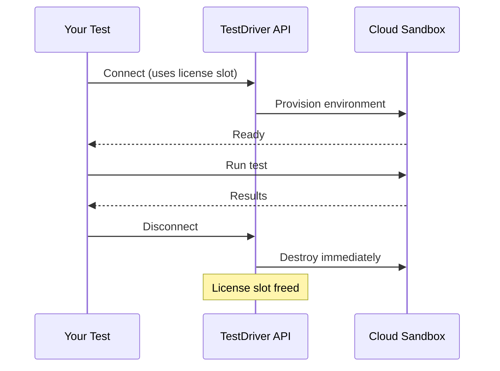

Get up and running with TestDriver in minutes. No infrastructure to manage, no servers to configure — just add your API key and start testing.

## Why Cloud?

<CardGroup cols={3}>
  <Card title="Zero Setup" icon="rocket">
    Start testing immediately. No AWS accounts, no CloudFormation, no DevOps required.
  </Card>
  <Card title="Free Tier" icon="gift">
    Get started with a limited amount of device-seconds at no cost.
  </Card>
  <Card title="Pay As You Go" icon="gauge">
    Only pay for the device-seconds you use. Scale up or down as needed.
  </Card>
</CardGroup>

## How It Works

TestDriver Cloud provisions sandboxed test environments on-demand. When your test runs:

1. **Connect** — Your test client connects to TestDriver's API
2. **Provision** — We instantly spin up an isolated sandbox environment
3. **Execute** — Your test runs in a clean, dedicated environment
4. **Cleanup** — The sandbox is destroyed immediately when your test disconnects



## Pricing Model

Cloud pricing is based on **device-seconds** — the amount of time your tests run on our infrastructure.

- **Free Tier**: Limited device-seconds to get started and evaluate TestDriver
- **Paid Plans**: Purchase device-seconds based on your testing needs

Visit our [Pricing Page](https://testdriver.ai/pricing) for current rates.

## Understanding License Slots

Your account has a set number of **license slots** that determine how many tests can run simultaneously. You can view your available slots in the [TestDriver Dashboard](https://console.testdriver.ai).

<Info>
  **When is a slot in use?** A license slot is occupied when a test client is connected. As soon as your test disconnects, the sandbox is destroyed and the slot becomes available immediately.
</Info>

### Avoiding Slot Conflicts

To prevent tests from failing due to exceeding your license slot limit, we recommend two key configurations:

#### 1. Set Maximum Concurrency in Vitest

Limit concurrent tests to match your available license slots:

```javascript vitest.config.mjs
import { defineConfig } from 'vitest/config';
import { TestDriver } from 'testdriverai/vitest';

export default defineConfig({
  test: {
    testTimeout: 900000,
    hookTimeout: 900000,
    maxConcurrency: 5, // Set to your license slot limit
    reporters: ['default', TestDriver()],
    setupFiles: ['testdriverai/vitest/setup'],
  },
});
```

<Tip>
  Check your slot count at [console.testdriver.ai](https://console.testdriver.ai) and set `maxConcurrency` to that number or lower.
</Tip>

#### 2. Use GitHub Concurrency Keys

Prevent multiple workflow runs from competing for the same slots by using [GitHub's concurrency controls](https://docs.github.com/actions/writing-workflows/choosing-what-your-workflow-does/control-the-concurrency-of-workflows-and-jobs):

```yaml .github/workflows/test.yml
name: Tests

on:
  push:
    branches: [main]
  pull_request:

# Prevent concurrent runs from competing for license slots
concurrency:
  group: ${{ github.workflow }}-${{ github.ref }}
  cancel-in-progress: true

jobs:
  test:
    runs-on: ubuntu-latest
    steps:
      - uses: actions/checkout@v4
      
      - name: Setup Node.js
        uses: actions/setup-node@v4
        with:
          node-version: '20'
      
      - name: Install dependencies
        run: npm install
      
      - name: Run tests
        run: npx vitest run
        env:
          TD_API_KEY: ${{ secrets.TD_API_KEY }}
```

The `concurrency` block ensures:
- Only one workflow run per branch runs at a time
- New pushes cancel in-progress runs on the same branch
- Different branches/PRs can run in parallel (up to your slot limit)

## Getting Started

<Steps>
  <Step title="Get Your API Key">
    Sign up at [console.testdriver.ai](https://console.testdriver.ai) and copy your API key.
  </Step>
  
  <Step title="Install TestDriver">
    ```bash
    npm install testdriverai vitest
    ```
  </Step>
  
  <Step title="Configure Vitest">
    Create `vitest.config.mjs` with your concurrency limit:
    
    ```javascript vitest.config.mjs
    import { defineConfig } from 'vitest/config';
    import { TestDriver } from 'testdriverai/vitest';

    export default defineConfig({
      test: {
        testTimeout: 900000,
        hookTimeout: 900000,
        maxConcurrency: 5, // Your license slot limit
        reporters: ['default', TestDriver()],
        setupFiles: ['testdriverai/vitest/setup'],
      },
    });
    ```
  </Step>
  
  <Step title="Write Your First Test">
    ```javascript tests/example.test.mjs
    import { describe, test } from 'vitest';
    import { chrome } from 'testdriverai';

    describe('My App', () => {
      test('loads homepage', async (context) => {
        const { testdriver } = await chrome(context, {
          url: 'https://example.com'
        });

        await testdriver.assert('the page has loaded');
      });
    });
    ```
  </Step>
  
  <Step title="Run Tests">
    ```bash
    TD_API_KEY=your-api-key npx vitest run
    ```
  </Step>
</Steps>

## When to Consider Self-Hosted

Cloud is perfect for getting started and for teams that want zero infrastructure management. However, you might consider [Self-Hosted](/v7/plans/self-hosted) if you:

- Want to escape per-second billing with a flat license fee
- Need full control over your infrastructure and privacy
- Want to use your own AI API keys
- Require custom hardware configurations
- Have high test volumes that make self-hosting more economical

<Card
  title="Explore Self-Hosted"
  icon="server"
  href="/v7/plans/self-hosted"
>
  Learn about self-hosting for unlimited test execution at a flat rate.
</Card>
