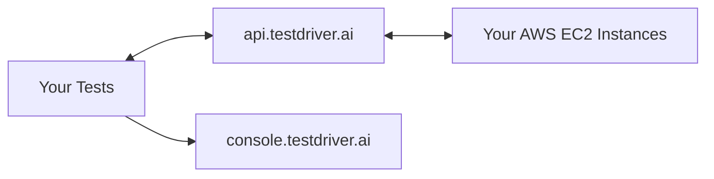

Take control of your test infrastructure. Self-hosting TestDriver gives you unlimited test execution, complete privacy, and the ability to customize everything — all for a predictable flat license fee.

## Why Self-Host?

<CardGroup cols={2}>
  <Card title="Escape Per-Second Billing" icon="dollar-sign">
    Pay a flat license fee per parallel test capacity instead of metered device-seconds. Run as many tests as you want.
  </Card>
  <Card title="Full Infrastructure Control" icon="sliders">
    Choose your instance types, configure networking, and customize the environment to match your exact requirements.
  </Card>
  <Card title="Privacy & Security" icon="shield-halved">
    Your tests run on your infrastructure. Your data never leaves your AWS account. Use your own AI API keys.
  </Card>
  <Card title="Debug & Customize" icon="wrench">
    RDP into test machines, install custom software, modify the AMI, and debug issues directly. No black boxes.
  </Card>
</CardGroup>

## How It Works

With self-hosting, you run test sandboxes on your own AWS infrastructure. TestDriver still provides:

- **Dashboard** — View test results, analytics, and reports at [console.testdriver.ai](https://console.testdriver.ai)
- **API** — Orchestration and AI-powered test execution
- **License Management** — Your parallel test capacity

You provide:

- **AWS Infrastructure** — EC2 instances running in your account
- **AI API Keys** — Use your own OpenAI, Anthropic, or other AI provider keys
- **Custom Configuration** — Hardware specs, networking, installed software

## Pricing Model

Self-hosted pricing is based on **parallel test capacity** — the number of tests you can run simultaneously.

- **Flat license fee** per parallel test slot
- **Unlimited test execution** — run as many tests as you want
- **No device-second metering** — predictable monthly costs

<Card
  title="Contact Sales"
  icon="envelope"
  href="https://calendly.com/d/cq23-qyn-3v6/testdriver-ai-demo"
>
  Get a custom quote based on your parallel test capacity needs.
</Card>

## Who Should Self-Host?

Self-hosting is ideal for teams that:

- **Run high test volumes** — Flat pricing becomes more economical at scale
- **Need complete privacy** — Sensitive applications, compliance requirements, or data residency concerns
- **Want infrastructure control** — Custom hardware, specific software dependencies, or network configurations
- **Prefer predictable costs** — Budget with confidence using flat monthly fees

<Note>
  **We prefer you self-host.** We know you're trying to do hard things, and we don't want to get in your way. Self-hosting gives you the control and flexibility to configure TestDriver exactly how you need it.
</Note>

## Supported Platforms

<Warning>
  TestDriver self-hosting currently supports **AWS only**. Support for additional cloud providers is planned.
</Warning>

## Getting Started

Ready to self-host? Follow our comprehensive AWS setup guide:

<Card
  title="AWS Setup Guide"
  icon="aws"
  href="/v7/plans/self-hosted-aws"
>
  Step-by-step instructions for deploying TestDriver on your AWS infrastructure using CloudFormation.
</Card>

The setup process involves:

1. **Deploy CloudFormation** — Create VPC, security groups, IAM roles, and launch templates
2. **Spawn Instances** — Use our scripts to launch EC2 instances on-demand
3. **Integrate with CI** — Connect your GitHub Actions or other CI/CD pipelines

## Comparison: Cloud vs Self-Hosted

| Feature | Cloud | Self-Hosted |
|---------|-------|-------------|
| **Setup Time** | Minutes | Hours |
| **Pricing Model** | Device-seconds | Flat license fee |
| **Infrastructure Management** | TestDriver | You |
| **Data Location** | TestDriver cloud | Your AWS account |
| **AI API Keys** | TestDriver's | Your own |
| **Custom Software** | Limited | Full control |
| **Hardware Selection** | Standard | Your choice |
| **Debugging Access** | Replays only | Full RDP access |

## Next Steps

<CardGroup cols={2}>
  <Card
    title="AWS Setup Guide"
    icon="aws"
    href="/v7/plans/self-hosted-aws"
  >
    Deploy TestDriver on AWS with CloudFormation
  </Card>
  <Card
    title="Contact Sales"
    icon="calendar"
    href="https://calendly.com/d/cq23-qyn-3v6/testdriver-ai-demo"
  >
    Discuss your requirements and get pricing
  </Card>
</CardGroup>
