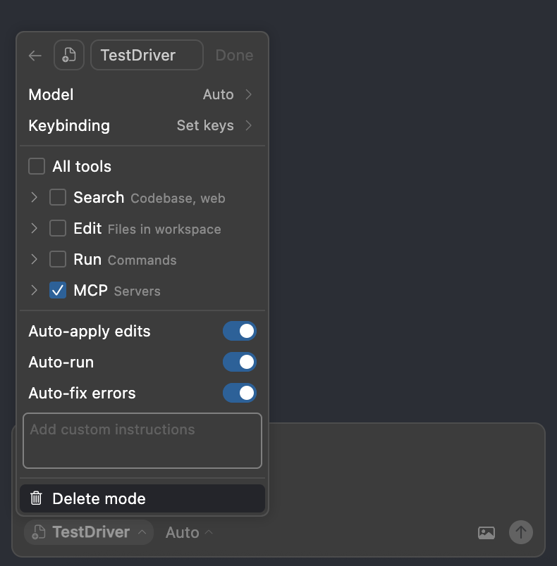

# @testdriver.ai/mcp

## Local Development

> [!NOTE]
> Run all commands in the **repository root**

Prequisites

1. `brew bundle`
1. Install `devbox` – 

If you haven't ran `caddy` (which this project uses) yet, you need to install root certificates:

1. `devbox shell`
1. `caddy run`

   You should be prompted for your password to install root certifications.

1. `devbox run dev`
1. Open [MCP Inspector](https://github.com/modelcontextprotocol/inspector):

   <http://127.0.0.1:6274/?transport=streamable-http&serverUrl=http://localhost:8324/stream>

1. Or, use it directly in Cursor with this project open.

   Until `.cursor/modes.json` are supported (https://docs.cursor.com/chat/custom-modes), it helps to make a custom mode:

   
